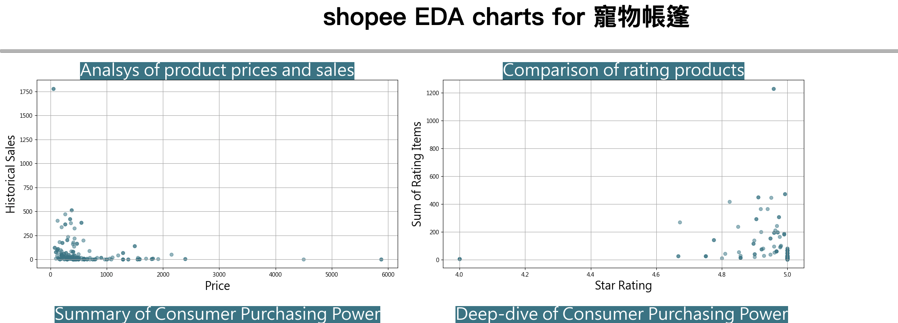
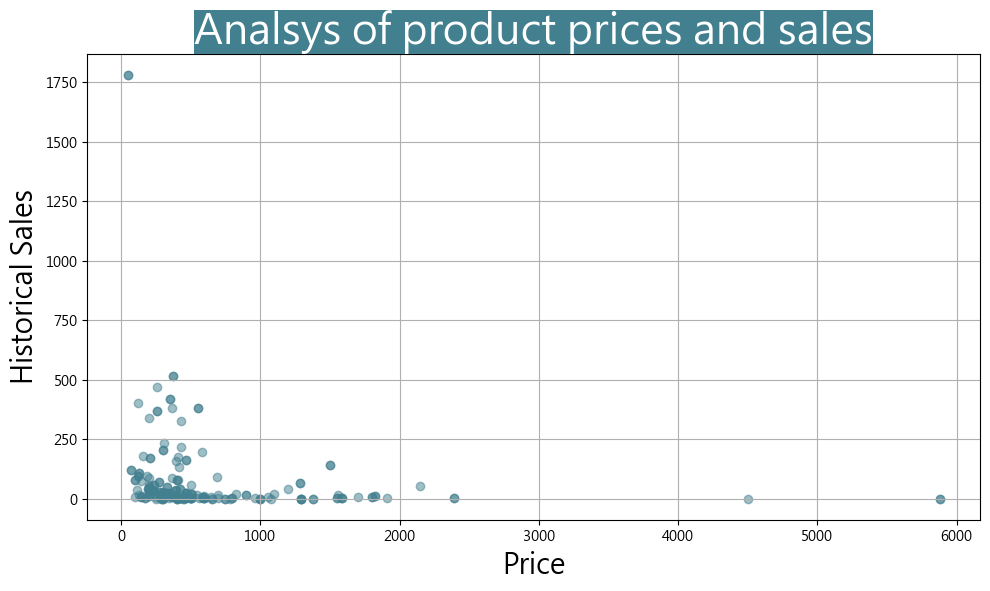
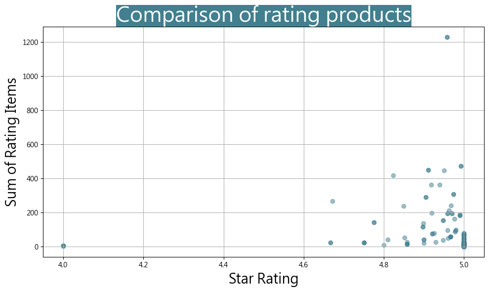
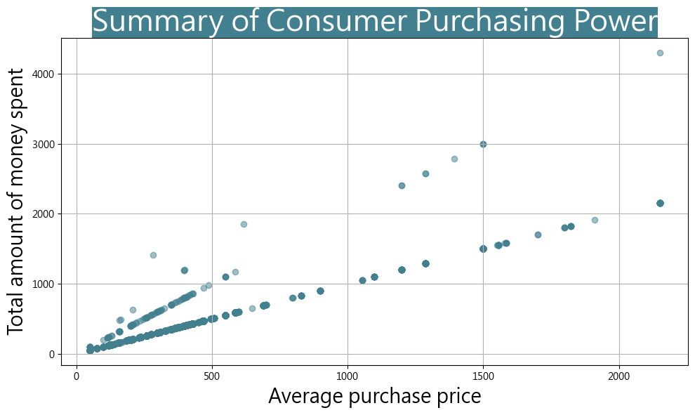
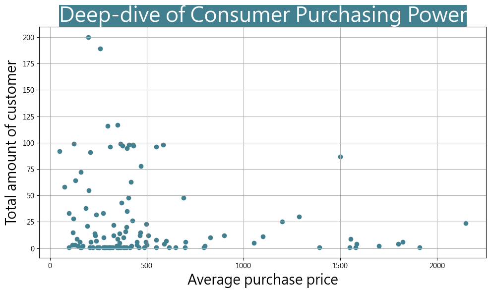
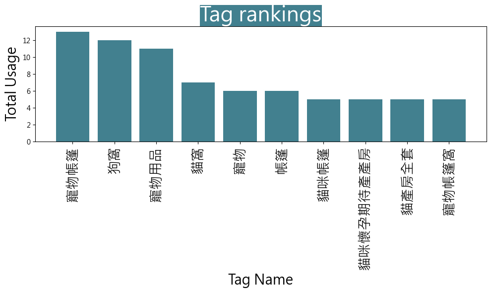
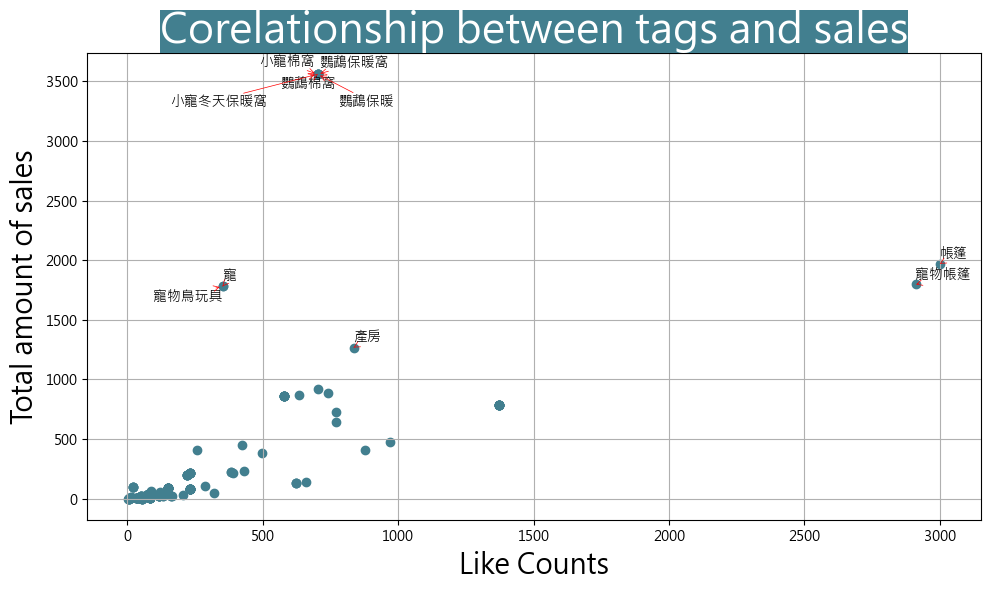

EDA Chart Explanation
=====================

In the case of searching 寵物帳篷, **e-market data explorer** will give you two CSV files after
the completion of ``scrap`` command. Then you will run ``eda`` command below to parse and plot
data to give you six charts and one html file for EDA process.

.. code-block:: console

    (.venv) $ python -m emarket_data_explorer eda shopee_寵物帳篷_product_goods.csv shopee_寵物帳篷_product_comments.csv

You can open the html file named shopee_eda_report.html by your browser and check out the report.

The report here addresses six questions below you want to get the answers through EDA process.

* What's the relationship between product price marketer sets and historical sale volume? Is it cheaper then bigger sales for product category you search?

* What about rating vs. how many it was given, I want to know that how many 4.8-star-ratings are given in this product category?

* What about consumer purchasing power - purchase price vs. total amount of money spent?

* What about deep-dive of consumer purchasing power - purchase price vs. total amount of customer who purchased at that price?

* What's the tag ranking, for example I want to know the most popular tag and the worst tag?

* What's the relationship between tags and sales? Is how many people liked a product, related to how many people purchase

Notice that EDA isn't limited to answering only 6 questions. It depends on your objective vs.
time you can spend on data drilling. We here give our user the minimum, but we're welcome to
hear of your feedback for any opportunity of improvement.