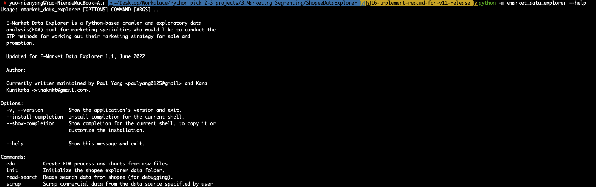

Get Started
===========

.. _installation:

Installation
------------

To use **e-market data explorer**, you firstly clone it from github and install the required package
using pip:

.. code-block:: console

   (.venv) $ git clone https://github.com/paulyang0125/E-MarketDataExplorer.git
   (.venv) $ pip install -r /path/to/requirements.txt

Execution
---------

You can run the following command to know about HOWTO.

.. code-block:: console

    (.venv) $ python -m emarket_data_explorer --help

You can run ``emarket_data_explorer Commands --help`` to get HOWTO of each command, for example:

.. code-block:: console

    (.venv) $ python -m emarket_data_explorer scrap --help

**e-market data explorer** supports 4 commands

#. ``init``: generate the configuration file. This is the first step you need to run after you download it but you only need to do it for once
#. ``scrap``: read search data from e-commercial site you specify and will generate the corresponding CSV file
#. ``eda``: explore the two scraped CSV files and generate the six charts to describe its EDA status.
#. ``read-search``: for debugging only, see the detail from --help

The first step you need to run after you download it but you only need to do it for once.
This generates the configuration file.

.. code-block:: console

    (.venv) $ python -m emarket_data_explorer init

Then, you can start to scrap with your product keyword. For example, when we're interested in
knowing pet product like pet tent ( *寵物帳篷* in Chinese ) and we want to have 100 items this time,
you can run the command below. The two CSV file will be generated in data folder path described
in the configuration file.

.. code-block:: console

    (.venv) $ python -m emarket_data_explorer scrap 寵物帳篷 100

.. image:: images/emarket_data_explorer_scrap.png
   :width: 600

Finally, you will use eda command to explore data in CSVs and generate the six charts to describe
its EDA status.

.. code-block:: console

    (.venv) $ python -m emarket_data_explorer eda shopee_寵物帳篷_product_goods.csv shopee_寵物帳篷_product_comments.csv

Test
----

**e-market data explorer** has ``pytest`` in place for the unit test. You can run the following
command to run the test.

.. code-block:: console

    (.venv) $ python -m pytest -vv --capture=tee-sys

Troubleshooting
---------------

**e-market data explorer** supports two options for debugging. You can set Verbose level
(``1`` stands for DEBUG which will output the messages as many as it can) and can also use
``read-index`` to clarify if **e-market data explorer** can work for reading the index.

.. code-block:: console

    (.venv) $ python -m emarket_data_explorer scrap 公事包 100 50 -ve 1

Read the index only for 10 product items.

.. code-block:: console

    (.venv) $ python -m emarket_data_explorer read-search 藍球鞋 2 5 --searcher_type 1

