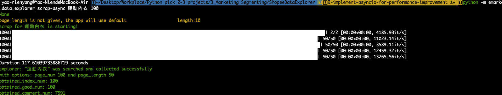
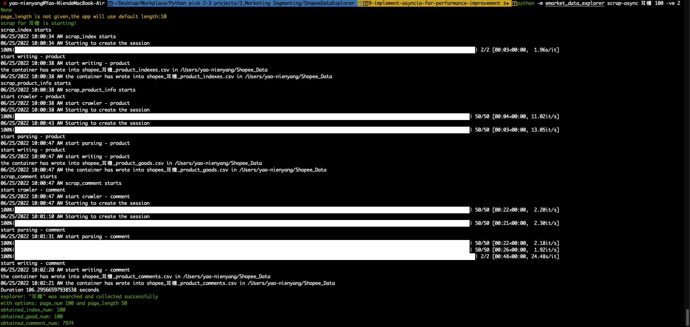

Get Started
===========

.. _installation:

Installation
------------

To use **e-market data explorer**, you install it from pypi using pip:

.. code-block:: console

   (.venv) $ git install emarket-data-explorer

Execution
---------

You can run the either two commands below to know about HOWTO.

.. code-block:: console

    (.venv) $ emarket-data-explorer --help

or

.. code-block:: console

    (.venv) $ python -m emarket_data_explorer --help

.. code-block:: console

    Usage: emarket_data_explorer [OPTIONS] COMMAND [ARGS]...

    E-Market Data Explorer is a Python-based crawler and exploratory data
    analysis(EDA) tool for marketing specialties who would like to conduct the
    STP methods for working out their marketing strategy for sale and promotion.

    Updated for E-Market Data Explorer 1.5, July 2022

    Author:

    Currently written and maintained by Paul Yang <paulyang0125@gmail> and Kana
    Kunikata <vinaknkt@gmail.com>.

    Options:
    -v, --version                   Show the application's version and exit.
    --install-completion [bash|zsh|fish|powershell|pwsh]
                                    Install completion for the specified shell.
    --show-completion [bash|zsh|fish|powershell|pwsh]
                                    Show completion for the specified shell, to
                                    copy it or customize the installation.
    --help                          Show this message and exit.

    Commands:
    eda          Create EDA process and charts from csv files
    init         Initialize the shopee explorer data folder.
    scrap-async  Scrap commercial data from the data source specified by user

You can run ``emarket-data-explorer [Commands] --help`` to get HOWTO of each command, for example:

.. code-block:: console

    (.venv) $ emarket-data-explorer scrap-async --help

or

.. code-block:: console

    (.venv) $ python -m emarket_data_explorer scrap-async --help

.. code-block:: console

    Usage: emarket_data_explorer scrap-async [OPTIONS] REQUIRED_ARGS...

    Scrap commercial data from the data source specified by user

    Arguments:
    REQUIRED_ARGS...          Here expects three inputs in sequence

                                1. keyword you want to search for

                                2. the number of product

                                3. the length of page (optional)

                                For example, e-market-data explorer scrap
                                basketball 100           [required]

    Options:
    -sm, --scrap_mode_for_shopee INTEGER RANGE
                                    we have three modes ALL, PRODUCT_ITEMS,
                                    PRODUCT_COMMENTS available. user can choose
                                    to scrap all two data (product or comment or
                                    index) or three for ALL. the default is 1
                                    for ALL.  [default: 1; 1<=x<=4]
    -ve, --verbose INTEGER RANGE    verbose 1 dumps all detailed debugging info,
                                    the default 3 just print error message if
                                    something bad happens.  [default: 3;
                                    1<=x<=3]
    --help                          Show this message and exit.

**e-market data explorer** supports three commands

#. ``init``: generate the configuration file. This is the first step you need to run after you download it but you only need to do it for once
#. ``scrap-async``: read search data from e-commercial site you specify and will generate the corresponding CSV file
#. ``eda``: explore the two scraped CSV files and generate the six charts to describe its EDA status.

The first command you need to run after you have installed it but you only need to do it for once.
This generates the configuration file.

.. code-block:: console

    (.venv) $ emarket-data-explorer init

or

.. code-block:: console

    (.venv) $ python -m emarket_data_explorer init

Then, you can start to scrap with your product keyword. For example, when we're interested in
knowing pet product like pet tent ( *寵物帳篷* in Chinese ) and we want to have 100 items this time,
you can run the command below. The two CSV file will be generated in data folder path described
in the configuration file.

.. code-block:: console

    (.venv) $ emarket-data-explorer scrap-async 寵物帳篷 100

or

.. code-block:: console

    (.venv) $ python -m emarket_data_explorer scrap-async 寵物帳篷 100

Finally, you will use eda command to explore data in CSVs and generate the six charts to describe
its EDA status.

.. code-block:: console

    (.venv) $ emarket-data-explorer scrap-async eda shopee_寵物帳篷_product_goods.csv shopee_寵物帳篷_product_comments.csv

or

.. code-block:: console

    (.venv) $ python -m emarket_data_explorer eda shopee_寵物帳篷_product_goods.csv shopee_寵物帳篷_product_comments.csv

.. image:: images/emarket_data_explorer_eda.png
   :width: 600

Troubleshooting
---------------

**e-market data explorer** supports two options for debugging. You can set Verbose level
(``1`` stands for DEBUG which will output the messages as many as it can) and can also use
``read-index`` by ``scrap_mode_for_shopee 4`` to clarify if **e-market data explorer** can work for reading the index.

.. code-block:: console

    (.venv) $ emarket-data-explorer scrap-async 公事包 100 50 -ve 1

or

.. code-block:: console

    (.venv) $ python -m emarket_data_explorer scrap-async 公事包 100 50 -ve 1

Read the index only for 50 product items.

.. code-block:: console

    (.venv) $ emarket-data-explorer scrap-async 藍球鞋 50 -sm 4

or

.. code-block:: console

    (.venv) $ python -m emarket_data_explorer scrap-async 藍球鞋 50 -sm 4

Dev
----

To develop **e-market data explorer**, you clone it from github and install the required package
using pip:

.. code-block:: console

   (.venv) $ git clone https://github.com/paulyang0125/E-MarketDataExplorer.git
   (.venv) $ pip install -r /path/to/requirements.txt

Test
----

**e-market data explorer** has ``pytest`` in place for the unit test. You can run the following
command to run the test.

.. code-block:: console

    (.venv) $ python -m pytest -vv --capture=tee-sys